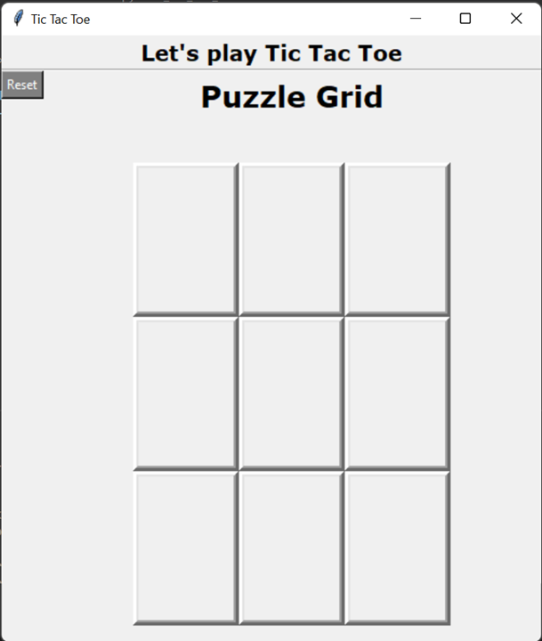

# QUIZ 2 OF DESIGN & ANALYSIS OF ALGORITHMS

## Members:
| Name                          | NRP        |
|-------------------------------|------------|
| M. Fadhil Rasyidin Parinduri  | 5025201131 |
| Haidar Fico Ramadhan Aryputra | 5025201185 |
| Nethaneel Patricio Linggar    | 5025201180 |

### Preface
In our second quiz project, the Minimax algorithm was chosen. It is an Adversarial Search, a search when there is an "enemy" or "opponent" who changes the state of the problem at every step in an unwanted direction. The program must consider the next state determined by the "opponent" which cannot be predicted with certainty. This search can play two types of games, general games or zero-sum games.
The problem we chose was also a game of Tic-tac-toe. This game is suitable to be solved by the Minimax algorithm which is designed to play zero-sum games like this game and is easy to understand when demonstrating.

### Solution Abstraction
To begin, let's start by defining what it means to play a perfect game of tic tac toe:
If I play perfectly, every time I play I will either win the game, or I will draw the game. Furthermore if I play against another perfect player, I will always draw the game.
How might we describe these situations quantitatively? Let's assign a score to the "end game conditions:"
•	I win, I get 10 points.
•	I lose, I lose 10 points (because the other player gets 10 points).
•	I draw, I get zero points, nobody gets any points.
So now we have a situation where we can determine a possible score for any game end state.
The key to the Minimax algorithm is a back and forth between the two players, where the player whose "turn it is" desires to pick the move with the maximum score. In turn, the scores for each of the available moves are determined by the opposing player deciding which of its available moves has the minimum score. And the scores for the opposing players moves are again determined by the turn-taking player trying to maximize its score and so on all the way down the move tree to an end state.
A description for the algorithm, assuming X is the "turn taking player," would look something like:
•	If the game is over, return the score from X's perspective.
•	Otherwise get a list of new game states for every possible move
•	Create a scores list
•	For each of these states add the minimax result of that state to the scores list
•	If it's X's turn, return the maximum score from the scores list
•	If it's O's turn, return the minimum score from the scores list
You'll notice that this algorithm is recursive, it flips back and forth between the players until a final score is found. 
To check if the current move is better than the best move, we take the help of the minimax() function which will consider all possible ways the game can go and return the best value for that move, assuming the opponent is also playing optimally.
Here is the Pseudocode for the minimax() function:
```
function minimax(board, depth, isMaximizingPlayer):

    if current board state is a terminal state :
        return value of the board
    
    if isMaximizingPlayer :
        bestVal = -INFINITY 
        for each move in board :
            value = minimax(board, depth+1, false)
            bestVal = max( bestVal, value) 
        return bestVal

    else :
        bestVal = +INFINITY 
        for each move in board :
            value = minimax(board, depth+1, true)
            bestVal = min( bestVal, value) 
        return bestVal
```
And this is how to set the minimizer and maximizer score:
```
def score(game)
    if game.win?(@player)
        return 10
    elsif game.win?(@opponent)
        return -10
    else
        return 0
    end
end
```
The graphical user interface (GUI) is a form of user interface that allows users to interact with electronic devices through graphical icons and audio indicator such as primary notation, instead of text-based UIs, typed command labels or text navigation. GUIs were introduced in reaction to the perceived steep learning curve of command-line interfaces (CLIs), which require commands to be typed on a computer keyboard.
Tkinter is a Python binding to the Tk GUI toolkit. It is the standard Python interface to the Tk GUI toolkit, and is Python’s de facto standard GUI. It is a fast and easy way of creating GUI applications.
GUI Layout:
